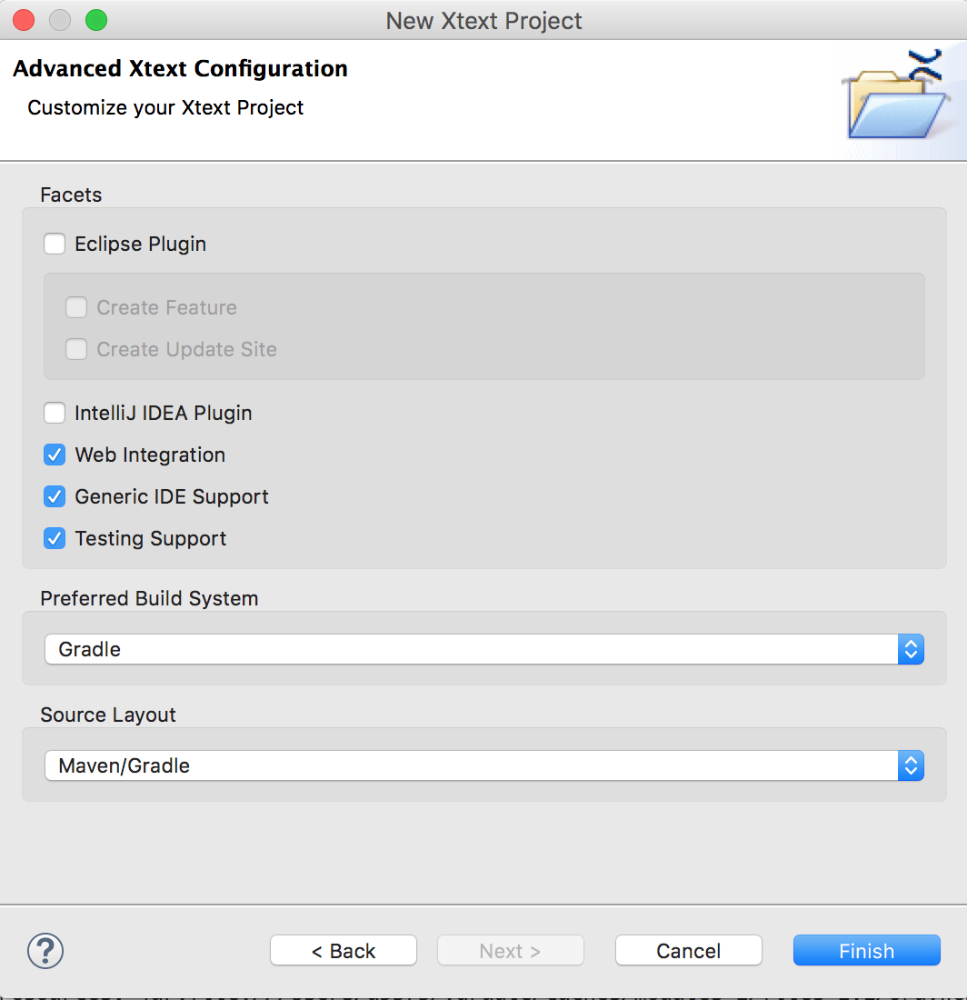

<link rel='stylesheet' href='web/swiss.css'/>

# Example 

Project corresponding to the example of the [15 minutes tutorial (extended)](https://eclipse.org/Xtext/documentation/102_domainmodelwalkthrough.html) using Xtext 2.10. 

Below I report some adaptations to guide my students. In particular, I added a new Gradle task to execute the compiler from command line.

## Modifications to 15 minutes tutorial (parser)

* When creating a new project, select the following configuration: 

* After having run the MWE workflow, add the following code in the project `org.example.domainmodel.web`, folder `src/main/java` in the class `org.example.domainmodel.web.DomainmodelWebModule`:

	def void configureIPreferenceValuesProvider(Binder binder) {
		binder.bind(IPreferenceValuesProvider).annotatedWith(FormatterPreferences).to(FormatterPreferenceValuesProvider)
	}

This code corresponds to a fix to [this bug](https://bugs.eclipse.org/bugs/show_bug.cgi?id=495851) fixed in Xtext 2.11 ([expected release in October 2016](https://projects.eclipse.org/projects/modeling.tmf.xtext/releases/2.11.0)).

## Modifications to 15 minutes tutorial - extended (code generation)

* When [writing a code generator](https://eclipse.org/Xtext/documentation/103_domainmodelnextsteps.html), the class `DomainmodelGenerator` has to implement the interface `IGenerator2`. Find below the resulting code:

	package org.example.domainmodel.generator
	
	import com.google.inject.Inject
	import org.eclipse.emf.ecore.resource.Resource
	import org.eclipse.xtext.generator.IGenerator2
	import org.eclipse.xtext.naming.IQualifiedNameProvider
	import org.example.domainmodel.domainmodel.Entity
	import org.example.domainmodel.domainmodel.Feature
	import org.eclipse.xtext.generator.IFileSystemAccess2
	import org.eclipse.xtext.generator.IGeneratorContext
	
	class DomainmodelGenerator implements IGenerator2 {
	 
	    @Inject extension IQualifiedNameProvider
	 
	    def compile(Entity e) ''' 
	        «IF e.eContainer.fullyQualifiedName != null»
	            package «e.eContainer.fullyQualifiedName»;
	        «ENDIF»
	        
	        public class «e.name» «IF e.superType != null
	                »extends «e.superType.fullyQualifiedName» «ENDIF»{
	            «FOR f : e.features»
	                «f.compile»
	            «ENDFOR»
	        }
	    '''
	 
	    def compile(Feature f) '''
	        private «f.type.fullyQualifiedName» «f.name»;
	        
	        public «f.type.fullyQualifiedName» get«f.name.toFirstUpper»() {
	            return «f.name»;
	        }
	        
	        public void set«f.name.toFirstUpper»(«f.type.fullyQualifiedName» «f.name») {
	            this.«f.name» = «f.name»;
	        }
	    '''
					
		override afterGenerate(Resource input, IFileSystemAccess2 fsa, IGeneratorContext context) {
		//		throw new UnsupportedOperationException("TODO: auto-generated method stub")
		}
		
		override beforeGenerate(Resource input, IFileSystemAccess2 fsa, IGeneratorContext context) {
		//		throw new UnsupportedOperationException("TODO: auto-generated method stub")
		}
		
		override doGenerate(Resource input, IFileSystemAccess2 fsa, IGeneratorContext context) {
			for (e : input.allContents.toIterable.filter(Entity)) {
	            fsa.generateFile(
	                e.fullyQualifiedName.toString("/") + ".java",
	                e.compile)
	        }
		}
					
	}

* Declare that the Xtend compiler should add a Main class (that parses, validates and compiles the DSL program), by adding the following code in the MWE2 workflow:

		Workflow {
			component = XtextGenerator {
				...
				language = StandardLanguage {
					...
					generator = {
						generateJavaMain = true
					}
				}
			}
		}
	
* The following Gradle task executes the compiler:

		task compileModel(dependsOn: 'classes', type: JavaExec) {
			main = 'org.example.domainmodel.generator.Main'	
			classpath = sourceSets.main.runtimeClasspath
			args model
		}

This task can be executed with the command `../gradlew compileModel -Pmodel=build/test.dmodel` that takes a parameter `model` to indicate the path to the file that contains the DSL program.